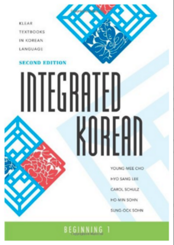

## Introduction

This is the first instalment of the "Integrated Korean" series that is used to learn Korean by myself. It can be accessed using this
[Textbook (PDF)](https://drive.google.com/file/d/1W-GK0Lagw_mXQbzWLgcxnplz4sz6GL5P/view?usp=sharing) link.

I am assuming that we already know how to read Korean alphabets (한글). If this is not known, access the introductory chapter in the above textbook. Alternatively, access the following link: [Korean Alphabets (howtostudykorean)](https://www.howtostudykorean.com/unit0/unit0lesson1/)

